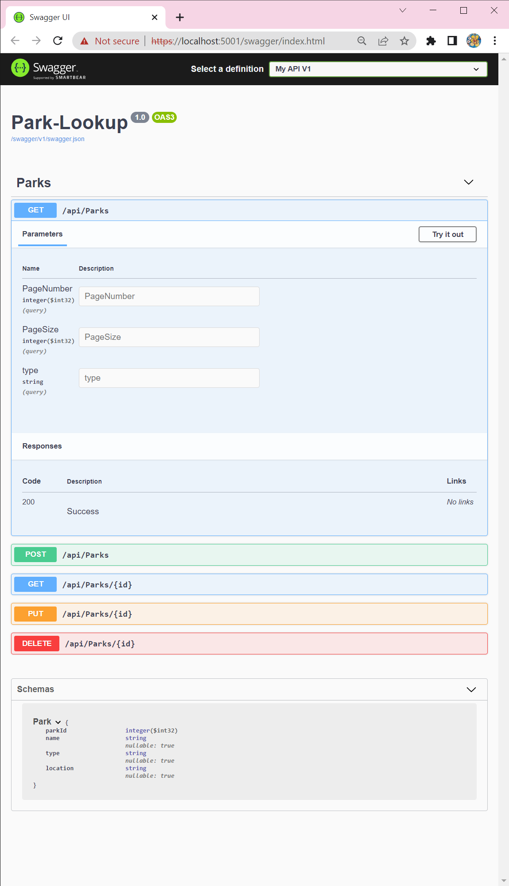
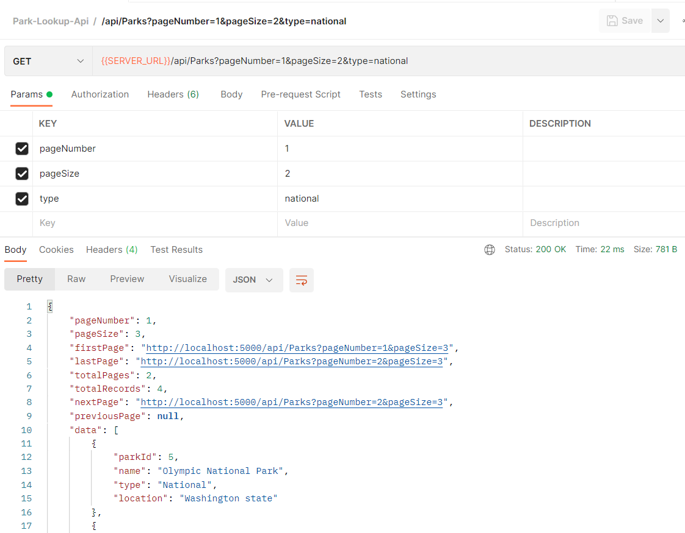

# Park Lookup

#### By: Viktoriia Zubarieva

## Description

An API for state and national parks. The API is able to list state and national parks.
This API is included full CRUD functionality, pagination to make sure responses are easier to handle amd swagger to present the functionality of the API in a more manageable package.

## Technologies Used

- C#
- .Net 5.0
- Git
- ASP.NET Core MVC
- Microsoft.EntityFrameworkCore
- Dotnet EntityFramework Tool
- Microsoft.EntityFrameworkCore.Design
- My SQL
- AspNet Core Web Api
- Swashbuckle

## Setup/Installation Requirements

- Clone this project to your desktop with the link provided on the its Github [repository](https://github.com/vzubarieva/Parks-Lookup.Solution)
- Navigate to the top level of the directory
- Create appsettings.json in Parks-Lookup.Solution/Park-Lookup/directory

- Copy this code into appsettings.json, replacing YOUR_PASSWORD with your MySQL password
  { "ConnectionStrings": { "DefaultConnection": "Server=localhost;Port=3306;database=factory;uid=root;pwd=YOUR_PASSWORD;" } }

- open new terminal and run SQL

  $ mysql -uroot -p{your_password}

- open MySQL Workbench

- In terminal, navigate into Parks-Lookup.Solution/Park-Lookup/ and enter this command, to install necessary packages

  $ dotnet restore

- enter this command to build the program

  $ dotnet build

- enter this command to build your database

  $ dotnet ef database update

- check MySql Workbench to make sure the correct database has built

- enter this command to view this application in your browser

  $ dotnet run

- endpoints available
  - GET /api/Parks
    - filters available
      - int `pageNumber`
      - int `pageSize`
      - string `type` (for example 'national' / 'state')
      - sample endpoint with all filters `/api/Parks?pageNumber=1&pageSize=2&type=national`
  - GET /api/Parks/{id}
  - POST /api/Parks/{id}
  - PUT /api/Parks/{id}
  - DELETE /api/Parks/{id}

## Known Bugs

- _No known bugs_

## License

_Message to viktoria.dubinina@gmail.com with any comments or contributions. This software is licensed under the MIT license_

Copyright (c) _September 2022_ _Viktoriia Zubarieva_
cd
